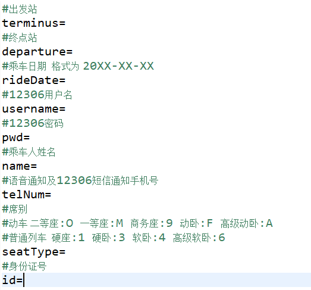

# GoHome
## 更新日志
    ·2019.03.22---------系统出现重大Bug，12306的验证码不能模拟获取，作者正在积极寻找问题。
## 概论
    本项目可以实现自动的刷票，登录，购票逻辑。
    全部流程为：
    1.查询用户输入的车次，若该车次无余票，则重复查询。
    2.自动登录，借用第三方的验证码自动识别技术，可以实现自动登录。
    3.购票，在购票时还会查询余票，若在购票时无余票，则返回第一步查询。
    4.购票完成，语音通知。
## 使用方法
    修改项目中的User.properties文件
 

 
## 注意
    1.由于语音通知服务是购买的阿里云的第三方服务，在代码中包含作者的用户名，密码和私钥，故做成了jar包，
    后期可能出现服务到期的现象，如果有开发者想要改进，可以将call.jar更换成自己的语音服务接口。
    2.本项目全部文件均为UTF-8编码。
    3.该项目的日志文件保存在/logs下，如果不想生成日志文件，可自行修改log4j.properties。
